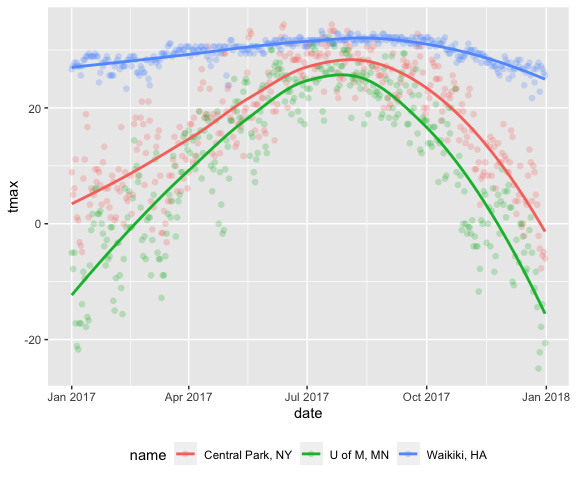
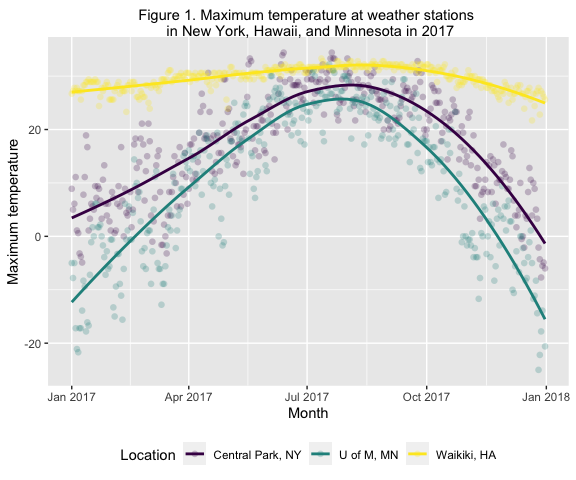
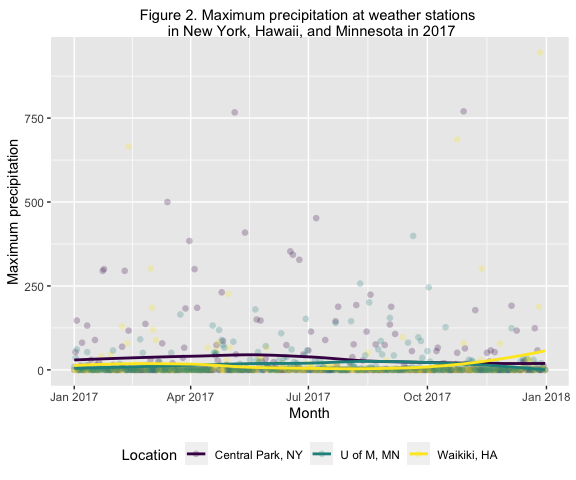

PUBH 7462 Week 2 Activity
================
Kristin Elgersma
1/28/22

### 1. Setup

``` r
#Load RNOAA interface (and install if it's not already)
if (!require("rnoaa")) {
  install.packages("rnoaa")
}

#Create a weather data frame  
weather.df <- rnoaa::meteo_pull_monitors(
    c("USW00094728", "USC00519397", "USC00214106"), #Location IDs
    var = c("PRCP", "TMIN", "TMAX"), #Variables 
    date_min = "2017-01-01", #Dates
    date_max = "2017-12-31") %>%
  mutate(
    name = recode(id, 
           USW00094728 = "Central Park, NY", #Recode IDs variable 
           USC00519397 = "Waikiki, HA",
           USC00214106 = "U of M, MN"
           ),
    tmin = tmin / 10, #Scale temperature for viz I think it's in Kelvin? 
    tmax = tmax / 10) %>%
  select(name, id, everything())

#Write out as .RDS (generic R data file, i.e. a data frame, list, etc.)
write_rds(weather.df, "./data/roaa_weather.RDS")
```

### 2. Example `ggplot` of Max Temperature

``` r
#Read in noaa_weather.RDS
weather.df <- read_rds("./data/roaa_weather.RDS")

#Create ggplot
max_temp.gg <- weather.df %>%
  ggplot(aes(x = date, y = tmax, colour = name)) + 
  geom_point(alpha = 0.24, #Transparency
             size  = 2,
             shape = 16) +
  geom_smooth(formula = y ~ x, 
              method  = "loess", #Smooth mean trend
              se      = FALSE) #No Confidence interval, crowds plot

#Display max_temp.gg
max_temp.gg
```



### 3. Updated `ggplot` of Max Temperature

``` r
max_temp.gg +
  labs(title = "Figure 1. Maximum temperature at weather stations \n in New York, Hawaii, and Minnesota in 2017", x = "Month", y = "Maximum temperature") +
  scale_colour_viridis_d("Location")
```



### 4. Create a `ggplot` of precipitation by location

``` r
#Create ggplot
precip.gg <- weather.df %>%
  ggplot(aes(x = date, y = prcp, colour = name)) + 
  geom_point(alpha = 0.24, #Transparency
             size  = 2,
             shape = 16) +
  geom_smooth(formula = y ~ x, 
              method  = "loess",
              se      = FALSE) +  
  labs(title = "Figure 2. Maximum precipitation at weather stations \n in New York, Hawaii, and Minnesota in 2017", x = "Month", y = "Maximum precipitation") +
  scale_colour_viridis_d("Location")

#Display max_temp.gg
precip.gg
```



### 5. Push to Github

If you’ve completed the first or both tasks, then please knit the
document as a `github_document`. Next, please add, commit, and push your
changes to the Github repository connected to this project. Note that
you will need to push all the associated files (contains the .html for
the figures you’ve created) as well as the .md and .rmd. In addition,
you may need to create a personal access token ([with these
instructions](https://docs.github.com/en/authentication/keeping-your-account-and-data-secure/creating-a-personal-access-token))
and use that as a password when prompted to login to github. Finally, go
back to your github and check out your fine work by clicking on the
newly knitted .md file in your repository!
